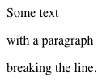

# CSS basics

the basics and more

---

## Linking CSS files

+++

### Linking CSS files

```html
<html>
<head>
  <link rel="stylesheet" href="main.css" />
</head>
<body>
  ...
</body>
</html>
```

---

## Selectors

+++

### Selector types

* Tag name selectors... `p`, `div`, ...  
	`<p />`
* Class selectors... `.className`  
	`<p class="className" />`
* ID selectors... `#idName`  
	`<p id="idName" />`
* Attribute selectors `[attribute="value"]`
	`<p attribute="value" />`
* Pseudo-class selectors... `:first-child`, `:hover`, ...
* Pseudo-elements... `::before`, `::after`

+++

### Selector types

You can combine selectors like so

```css
a.fancy-box[href="https://example.org"] { 
  display: inline-block;
  padding: 1px 2px;
  margin: 0 -2px;
  background: pink;
}
```

This would select all anchor tags that have the class *.fancy-box* and link to
*https://example.org*. 

---

### Attribute selectors

* `[attribute]` … element with a certain attribute
* `[attribute="value"]` … element with exact attribute value
* `[attribute^="value"]` … starts with value
* `[attribute$="value"]` … ends with value
* `[attribute*="value"]` … contains value
* `[attribute operator value i]` … the i makes it case insensitive

Quotes are mostly optional and you can also use single quotes as well.

+++

#### Attribute selectors

Let's consider the following `html` code:

```html
<body>
  <input type="text" data-ref="https://example.org/" />
  <input type="password" />
</body>
```

+++

#### `[attribute]`

This checks if an element has a certain attribute defined.
The value does not matter and since we are always dealing with strings, "false"
is not actually a boolean value and would still be matched with `[attribute]`.

```css
[data-ref] {
  background: pink;
}
```

+++

#### `[attribute="value"]`

Selecting an element with a certain attribute. This selector is an exact
selector.

```css
[type="password"] {
  border: 2px solid red;
}
```

+++

#### `[attribute="value"]`

This won't match with any of our elements:

```css
[data-ref="https"] { /* ... */ }
```

The `data-ref` value needs to be the exact value that we are requesting.
But there is actually an operator to solve this...

+++

#### `[attribute^="value"]`

The `^=` operator checks against the beginning of an attribute. If we change
the operator of the previous slide, our CSS selector should work just fine:

```css
[data-ref^="https"] {
  border: 2px solid green;
}
```

This would match  
**`data-ref`**`="`**`https`**`://example.org/"`

+++

#### `[attribute$="value"]`

The `$=` operator will test against the end of an attributes value.

```css
[data-ref$="/"] { /* ... */ }
```

This would match  
**`data-ref`**`="https://example.org`**`/`**`"`  
`-----------------------------^`

+++

#### `[attribute*="value"]`

The `*=` operator checks if an attribute contains a certain value.

```css
[data-ref*="example.org"] { /* ... */ }
```

This would match  
**`data-ref`**`=https://`**`example.org`**`/"`

+++

#### `[attribute operator value i]`

A trailing `i` would make the selector case insensitive.

```css
[data-ref*="EXAMPLE.ORG" i] { /* ... */ }
```

This would still match our element.

---

### Pseudo classes

+++

### TODO Pseudo classes

* Caveats
  * `:first-child` and `:last-child` will ignore the element tag type

```
  <div>
    <span>Element 1</span> <!— this is the :first-child —>
    <p>Element 2</p> <!— p:first-child won't work here —>
  </div>
```

+++

### TODO Pseudo classes

`:active, :any-link, :checked, :blank, :default, :defined, :dir(), :disabled,
:empty, :enabled, :first, :first-child, :first-of-type, :fullscreen, :focus,
:focus-within, :has(), :host(), :host-context, :hover, :indeterminate,
:in-range, :invalid, :lang(), :last-child, :last-of-type, :left, :link,
:matches() (:any()), :not(), :nth-child(), :nth-last-child(), :nth-last-of-type(),
:nth-of-type(), :only-child, :only-of-type, :optional, :out-of-range,
:placeholder-shown, :read-only, :read-write, :required, :right, :root, :scope,
:target, :valid, :visited`

---

### Pseudo elements

+++

### TODO: Pseudo elements

`::after, ::backdrop, ::before, ::cue, ::first-letter, ::first-line,
::grammar-error, ::placeholder, ::selection, ::slotted(), ::spelling-error`

---

## Combinators

+++

### Descendant combinator

To select an `a` tag inside a `div` you can combine them with a space:

```css
div a {
  text-decoration: none;
  font-style: italic;
}
```

This will select any `a` tag inside any `div` no matter if another element is
wrapping it.

```html
<div>
  <p>
    <a /> <!-- this will still be selected -->
  </p>
</div>
```

+++

### Child combinator

If you want to select a direct child you can use the `>` combinator.  
Keeping our example but adding this combinator like so:

```css
div > a { /* ... */ }
```

```html
<div>
  <a /> <!-- this is being selected -->
  <p>
    <a /> <!-- this however will not -->
  </p>
</div>
```

+++

### Adjacent sibling combinator

You can select an element that is followed by a certain other sibling with `+`:

```css
input + span {
  font-weight: bold;
}
```

```html
<input />
<span>This will be printed in bold</span>
<span>This will be printed in a regular font</span>
```

+++

### General sibling combinator

If you want to style all following elements of after a certain sibling you can
use the `~` combinator:

```css
input ~ span {
  font-weight: bold;
}
```

```html
<input />
<span>This will be printed in bold</span>
<span>This will be printed in bold as well</span>
```

---

## Box model

+++

### Box model

From the outside to the inside

* margin
* border
* padding
* content

So usually setting the width and height of an element only changes the width
and height of the content itself but does not take into account the outer boxes
for padding, border and margin.

+++

### Box model

To get around this you *could* use the CSS function `calc` but that is a bit of
a mess anyway. So instead we can use
`box-sizing` and set it to `border-box`.
As the value suggests, this will take *border* and *padding* into account,
but still leaves *margin* untouched.

+++

### Box model

```css
div {
  margin: 2em;
  padding: 2em;
  width: 50%;
  background: rgba(74, 172, 250, .5);
}
```

```html
<div>
  <div>Hello world</div>
</div>
```

---

## Positioning

+++

### Positioning

You can freely position any elements. However, use this only sparingly.
Often you don't want to break elements from their natural flow.

Anyway... the available property values are as followed:

* static
* relative
* absolute
* fixed
* sticky *(no IE support, partially supported in other browsers)*

+++

### Positioning

Why you usually don't want to position elements freely:

TODO

---

### Display modes

There are a ton of display modes for an element. These are as follows:


#### `<display-outside>`

* **block**
* **inline**
* run-in

+++

#### `<display-inside>`

* flow
* flow-root
* table
* **flex**
* **grid**
* ruby *(used for other markup languages like XML)*

#### `<display-listitem>`

* list-item

+++

#### `<display-internal>`

* table-row-group
* table-header-group
* table-footer-group
* table-row
* table-cell
* table-column-group
* table-column
* table-caption
* ruby-base
* ruby-text
* ruby-base-container
* ruby-text-container

+++

#### `<display-box>`

- contents
- **none**

#### `<display-legacy>`

* **inline-block**
* inline-table
* **inline-flex**
* **inline-grid**

+++

#### Global values 

* **inherit**
* initial
* unset

+++

##### display: block

Setting an element to `display: block` generates a line break before and after
the block. Additionally the dimension can be manipulated as well.

Some elements like `div` and `p` are set to `display: block` by default.

```html
Some text <p>with a paragraph</p> breaking the line.
```

+++



+++

##### display: inline

Changing an element to `display: inline` makes it flow within a line. Setting
the dimension won't necessarily take any effect.

Some elements like `span` and `a` are `inline` by default.

```css
p {
  display: inline;
}
```

```html
Some text <p>with an inline paragraph</p> and no line-break.
```

+++


+++

##### display: inline-block

`inline-block` is a combination of a `block` and `inline` element, causing it to
flow within a line but also allows for dimension changes.

```css
span {
  display: inline-block;
  padding: 5px;
  background: yellow;
}
```

```html
Some text <span>with a span element</span>.
```

+++


+++

##### display: flex

The `display: flex` makes the outer box a block element and the content
flexible.

Flexbox allows you to align child elements in a controlled way, similar to
table cells.

+++

##### display: inline-flex

Similar to `display: block`, `inline-flex` allows the content to be flexible but
won't cause line breaks for the outer bound box.

+++

##### display: grid

`display: grid` is in a way similar to `display: flex` but other than just
controlling child elements in only one dimension, you can control their flow
both horizontally and vertically.

+++

##### display: inline-grid

Same as before. The content is going to be a grid, the outside is inlined
without line breaks.

+++

##### display: inherit

`inherit` is a special CSS keyword. In this case it causes the element to take
on the computed value of its parent element.

---

## flex

+++

### flex

#### justify-content

Applied to the flex container, sets how child elements should be rendered
(per default) horizontally.

Possible options:

- flex-start: all elements are aligned to the left.
- flex-end: all elements are aligned to the right.
- center: aligned to the center.
- space-between: aligned from the left to the right with gaps inbetween.
- space-around: items are evenly distributed with less gap on the edges.
- space-evenly: items are evenly distributed with evenly spaced gaps to the
  edges.

+++

### flex

#### align-items

Sets how the child elements are aligned on a vertical level.

Possible options:

- flex-start: all elements are aligned to the top.
- flex-end: all elements are aligned to the bottom.
- center: aligned to the center.
- stretch: elements height is being stretched to the containers height.
- baseline: elements are aligned to the same baseline.

+++

### flex

#### align-content

This aligns a flex container's lines within when there is extra space in the
cross-axis. Similar to how `justify-content` aligns individual items within the
main-axis.

Possible options:

- flex-start: all lines aligned to the top.
- flex-end: all lines aligned to the bottom.
- center: all lines centered together.
- space-between: lines evenly distributed without a gap to the edges.
- space-around: lines evenly distributed with equal space around each line.
- stretch: all lines are stretched so they fill the containers height.

+++

### flex

#### flex-grow

+++

### flex

#### flex-wrap

+++

### flex

#### order

+++

### flex

#### Caveats

+++

### flex

- https://css-tricks.com/snippets/css/a-guide-to-flexbox/

---

## grid

---

## Specificity

+++

### Specificity

The priority of rules and how to calculate them

* `*` = 0
* `element` = 1
* `.class` = 10
* `[attributes]` = 10
* `#id` = 100
* style-attributes = 1000

When there are 2 rules with the same level of specificity the latter is applied.

---

## Semantics

+++

### Semantics

* Don't just use `div` and `span`.
* TODO

---

## Accessibility

+++

### Accessibility

Further readings
https://moritzgiessmann.de/accessibility-cheatsheet/

---

### Custom properties
#### *(aka "something-like-variables-but-better")*
